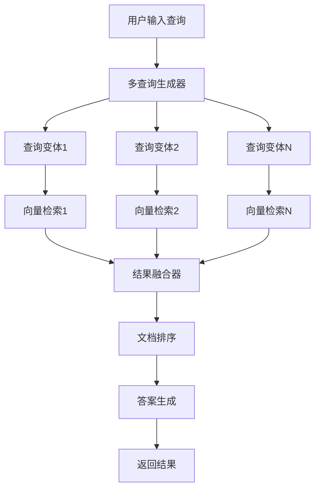

# 第20小节：多查询（Multi-Query）RAG优化策略

## 概述

多查询（Multi-Query）RAG是一种先进的检索增强生成技术，通过将用户的单一查询转换为多个语义相似但表达方式不同的查询变体，从而显著提高文档检索的准确性和召回率。该策略特别适用于处理模糊查询和多语义类型的问题，能够弥补单一问法可能存在的语义偏差。

## 核心概念

### 1. 多查询RAG的工作原理



### 2. 核心组件

- **查询生成器**：使用LLM生成多个语义相似的查询变体
- **并行检索器**：对所有查询变体进行向量检索
- **结果融合器**：合并和去重检索到的文档
- **排序算法**：基于相关性分数对文档进行排序

## 技术优势

### 1. 提高检索召回率
- 通过多个查询变体覆盖更多相关文档
- 减少因单一查询表达局限性导致的遗漏

### 2. 增强语义理解
- 不同表达方式捕获查询的多个语义层面
- 提高对模糊或复杂查询的理解能力

### 3. 提升系统鲁棒性
- 降低对特定查询表达的依赖
- 增强对用户输入变化的适应性

## 与其他策略的对比

| 策略 | 查询数量 | 检索复杂度 | 召回率 | 精确度 | 适用场景 |
|------|----------|------------|--------|--------|-----------|
| 传统RAG | 1 | 低 | 中 | 中 | 明确查询 |
| 查询重写 | 1 | 低 | 中高 | 中高 | 需要优化的查询 |
| 多查询RAG | 3-5 | 中 | 高 | 高 | 复杂或模糊查询 |

## 技术实现

### 1. 核心依赖

```python
from langchain.retrievers.multi_query import MultiQueryRetriever
from langchain_openai import ChatOpenAI
from langchain_community.vectorstores import Chroma
from langchain.schema import Document
```

### 2. 基本使用流程

```python
# 1. 初始化LLM
llm = ChatOpenAI(model="deepseek-chat")

# 2. 创建多查询检索器
retriever = MultiQueryRetriever.from_llm(
    retriever=vector_store.as_retriever(),
    llm=llm
)

# 3. 执行检索
documents = retriever.get_relevant_documents(query)
```

### 3. 自定义查询生成

```python
class CustomMultiQueryRetriever(MultiQueryRetriever):
    def generate_queries(self, question: str) -> List[str]:
        """生成自定义查询变体"""
        prompt = f"""
        基于以下问题，生成3个语义相似但表达不同的查询变体：
        原问题：{question}
        
        要求：
        1. 保持原意不变
        2. 使用不同的表达方式
        3. 每行一个查询
        """
        response = self.llm.invoke(prompt)
        return response.content.strip().split('\n')
```

## 性能优化策略

### 1. 查询生成优化
- 控制查询变体数量（通常3-5个最佳）
- 优化提示词模板提高生成质量
- 添加查询去重机制

### 2. 检索优化
- 使用异步并行检索提高速度
- 设置合理的检索文档数量限制
- 实现智能缓存机制

### 3. 结果融合优化
- 实现基于相关性分数的加权融合
- 添加文档去重和排序算法
- 支持多种融合策略选择

## 应用场景

### 1. 适用场景
- **模糊查询**：用户表达不够精确的问题
- **专业领域**：需要多角度理解的专业问题
- **多语义查询**：包含多个语义层面的复杂问题
- **知识发现**：需要全面检索相关信息的场景

### 2. 不适用场景
- **简单事实查询**：答案明确且单一的问题
- **实时性要求高**：对响应速度要求极高的场景
- **资源受限**：计算资源或API调用受限的环境

## 最佳实践

### 1. 查询生成
- 设计高质量的提示词模板
- 控制生成查询的多样性和相关性平衡
- 实现查询质量评估机制

### 2. 检索策略
- 根据查询类型动态调整检索参数
- 实现多级检索策略
- 添加检索结果质量监控

### 3. 结果处理
- 实现智能的文档去重算法
- 基于多个维度进行结果排序
- 提供结果解释和溯源功能

## 文件结构

```
20_multi_query/
├── README.md                 # 本文档
├── multi_query_demo.py      # 多查询RAG演示程序
├── requirements.txt         # 依赖包列表
└── examples/               # 示例文档目录
    └── sample_docs.txt     # 示例文档
```

## 运行示例

```bash
# 进入目录
cd tutorials/20_multi_query

# 安装依赖
pip install -r requirements.txt

# 运行演示
python multi_query_demo.py
```

## 参考资料

1. [LangChain MultiQueryRetriever文档](https://python.langchain.com/docs/modules/data_connection/retrievers/multi_query)
2. [RAG优化策略综述](https://arxiv.org/abs/2312.10997)
3. [多查询检索技术原理](https://blog.langchain.dev/query-construction/)

## 注意事项

1. **API调用成本**：多查询会增加LLM API调用次数，需要考虑成本控制
2. **响应时间**：并行检索虽然优化了速度，但总体响应时间仍会增加
3. **查询质量**：生成的查询变体质量直接影响最终检索效果
4. **资源消耗**：需要更多的计算资源和存储空间

通过合理使用多查询RAG策略，可以显著提升检索系统的性能和用户体验，特别是在处理复杂查询和专业领域问题时效果尤为明显。