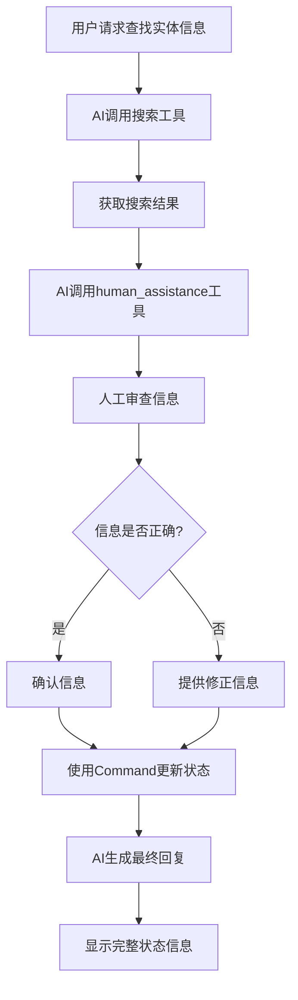

# 第25小节：LangGraph自定义状态

## 概述

本教程演示如何在LangGraph中使用自定义状态来构建更复杂的聊天机器人。通过扩展基础的消息状态，我们可以添加业务相关的字段来实现实体信息查找、存储和人工审查验证功能。

## 核心概念

### 1. 自定义状态类

在LangGraph中，状态是图中节点之间传递数据的核心机制。我们可以通过继承`TypedDict`来定义自定义状态：

```python
from typing import Annotated, List
from typing_extensions import TypedDict
from langgraph.graph.message import add_messages

class State(TypedDict):
    """自定义状态类，包含消息和实体信息"""
    # 消息列表，使用add_messages进行自动合并
    messages: Annotated[List, add_messages]
    
    # 实体名称
    name: str
    
    # 实体生日/发布日期
    birthday: str
    
    # 验证状态：pending, verified, corrected
    verification_status: str
    
    # 搜索结果列表
    search_results: List[dict]
```

### 2. 工具内状态更新

使用`Command`对象可以在工具内部更新状态字段：

```python
from langgraph.prebuilt import Command
from langchain_core.messages import ToolMessage

@tool
def human_assistance(
    name: str, 
    birthday: str, 
    tool_call_id: Annotated[str, InjectedToolCallId]
) -> Command:
    """请求人工协助验证实体信息"""
    # 人工交互逻辑
    human_response = interrupt({
        "question": "请验证以下信息是否正确？",
        "name": name,
        "birthday": birthday,
    })
    
    # 使用Command对象更新状态
    state_update = {
        "name": verified_name,
        "birthday": verified_birthday,
        "verification_status": "verified",
        "messages": [ToolMessage(response, tool_call_id=tool_call_id)],
    }
    
    return Command(update=state_update)
```

### 3. InjectedToolCallId

`InjectedToolCallId`是LangGraph提供的特殊注解，用于自动注入工具调用ID：

```python
from langgraph.prebuilt import InjectedToolCallId
from typing import Annotated

def my_tool(param: str, tool_call_id: Annotated[str, InjectedToolCallId]):
    # tool_call_id会被自动注入，无需手动传递
    pass
```

## 功能特性

### 🔍 实体信息查找
- 集成Tavily搜索API
- 自动查找实体的发布日期或生日信息
- 格式化搜索结果展示

### 👤 人工审查验证
- 人工在环验证机制
- 支持信息确认或修正
- 实时状态更新

### 📊 状态管理
- 自定义状态字段
- Command对象状态更新
- 状态持久化和查看

### 🛠️ 工具集成
- 搜索工具
- 人工协助工具
- 时间工具

## 使用方法

### 1. 安装依赖

```bash
pip install langchain langgraph tavily-python
```

### 2. 配置环境变量

```bash
# 设置LLM API密钥（选择其一）
export DEEPSEEK_API_KEY="your-deepseek-api-key"
export OPENAI_API_KEY="your-openai-api-key"
export QWEN_API_KEY="your-qwen-api-key"

# 设置Tavily搜索API密钥
export TAVILY_API_KEY="your-tavily-api-key"
```

### 3. 运行演示

```bash
cd tutorials/25_langgraph_custom_state
python custom_state_demo.py
```

### 4. 演示功能

程序提供以下演示选项：

1. **实体信息查找演示** - 演示查找LangGraph发布日期的完整流程
2. **人工验证流程演示** - 展示人工审查、确认或修正信息的交互过程
3. **状态显示演示** - 查看完整的状态信息，包括验证后的实体数据
4. **自由对话模式** - 与自定义状态聊天机器人进行开放式对话

## 核心流程



## 技术要点

### 状态字段说明

| 字段名 | 类型 | 说明 |
|--------|------|------|
| messages | List | 对话消息列表，使用add_messages自动合并 |
| name | str | 实体名称 |
| birthday | str | 实体生日/发布日期 |
| verification_status | str | 验证状态：pending/verified/corrected |
| search_results | List[dict] | 搜索结果列表 |

### Command对象使用

`Command`对象是LangGraph中用于在工具内部更新状态的机制：

```python
# 更新状态
return Command(update={"field": "value"})

# 同时更新状态和返回消息
return Command(
    update={"field": "value"},
    graph=StateGraph(...)
)
```

### 错误处理

- 网络请求异常处理
- API密钥验证
- 用户输入验证
- 状态更新失败处理

## 扩展建议

1. **添加更多实体类型** - 支持人物、公司、产品等不同类型的实体
2. **增强搜索功能** - 集成多个搜索源，提高信息准确性
3. **状态持久化** - 使用数据库存储状态信息
4. **Web界面** - 开发Web界面替代命令行交互
5. **批量处理** - 支持批量查找和验证多个实体

## 参考资料

- [LangGraph官方文档](https://langchain-ai.github.io/langgraph/)
- [LangChain工具文档](https://python.langchain.com/docs/modules/tools/)
- [Tavily搜索API](https://tavily.com/)
- [TypedDict文档](https://docs.python.org/3/library/typing.html#typing.TypedDict)